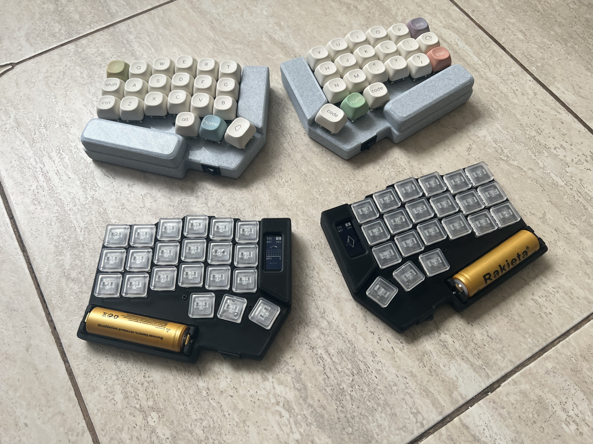
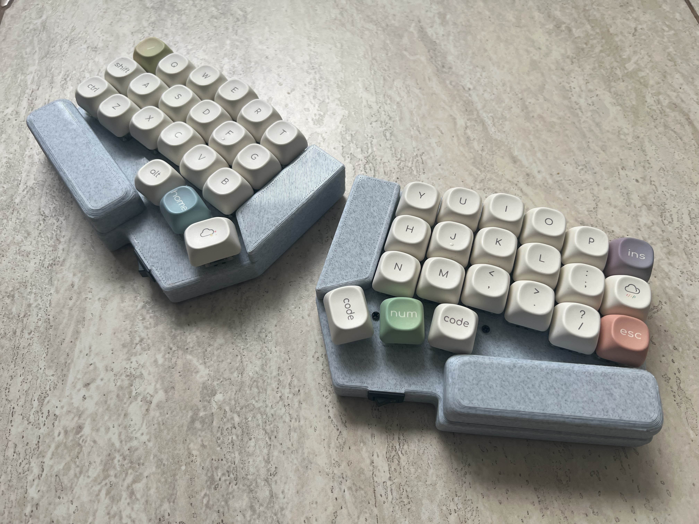
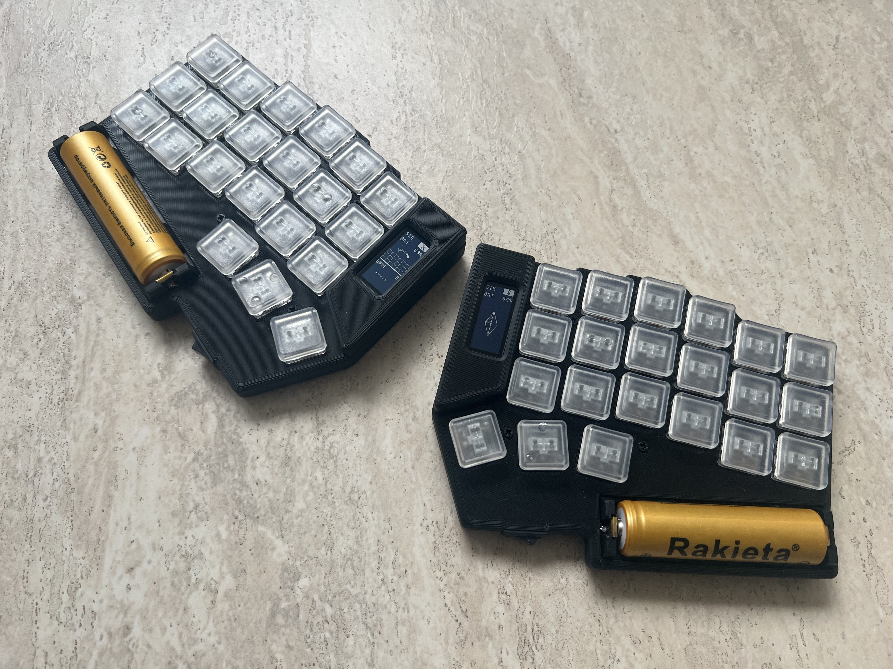
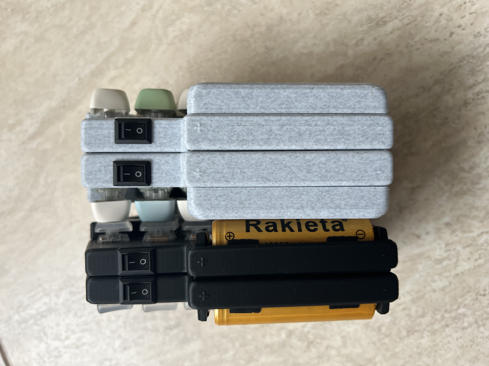

## About

This is a case for the popular Corne keyboard, specifically for the wireless v3.0.1 version. It supports both MX and Choc switches.

The standout feature of this case is its battery solution. I was tired of compact designs that prioritize a small form factor but require weekly recharging. I was also fed up with the battery dying at the worst possible moment, forcing me to find two cables to charge a split keyboard. That's why I designed this case, which includes a dedicated socket for an 18650 battery. A single charge lasts for at least a month, even when the keyboard is left on with its displays running animations 24/7.

Additionally, the case provides a cutout for an external power switch, as the default switch on the PCB isn't designed for frequent toggling and is difficult to reach.

The case also has slots for neodymium magnets, allowing the two halves to snap together for easy transport.

## Building

You will need:

- 14 x M2x5x3.5 heat-set inserts  
- 14 x M2x12mm screws for MX or M2x8mm for Choc  
- 2 x 2-pin toggle switches (10x15 mm)  
- 2 x 18650 battery holders  
- 2 x 18650 batteries  
- 10 x 7x4mm neodymium magnets OR 20 x 7x2mm neodymium magnets (you can get by with just ten 7x2mm magnets, but the connection will be weaker)  
- 10 x 5x2mm anti-slip rubber feet  
- 4 x JST 1.25mm connector pairs (male+female)  

## Images

